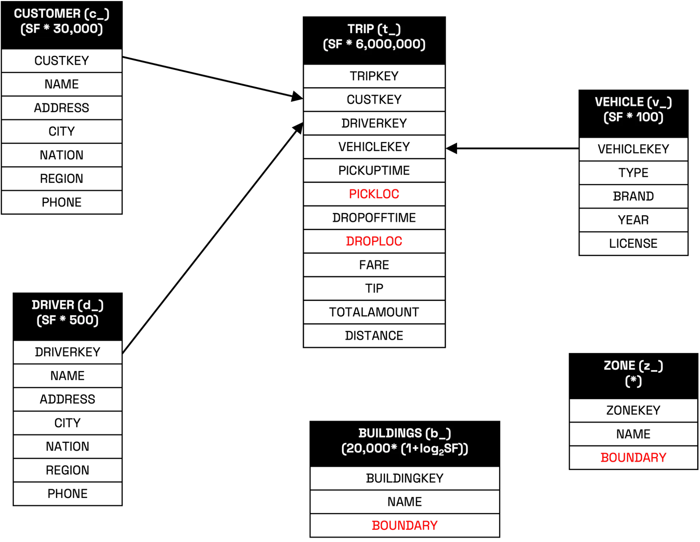
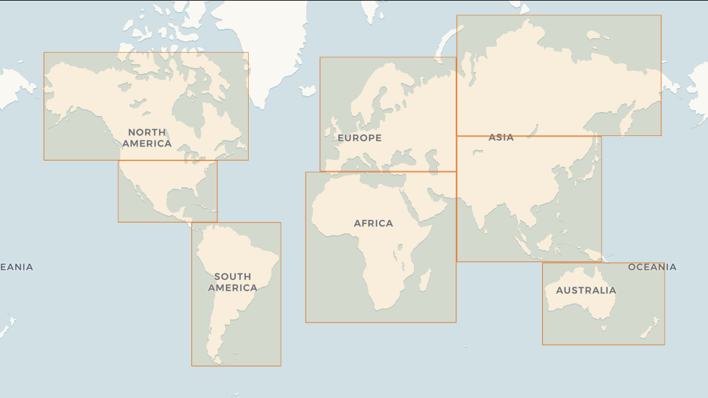

# SpatialBench

SpatialBench is a benchmark for assessing geospatial SQL analytics query performance across database systems. It provides a reproducible and scalable way to evaluate the performance of spatial data engines using realistic synthetic workloads.

Goals:

- Establish a fair and extensible benchmark suite for spatial data processing.
- Help users compare engines and frameworks across different data scales.
- Support open standards and foster collaboration in the spatial computing community.

## Queries
SpatialBench includes a set of 12 SQL queries. Because spatial sql syntaxes vary widely across systems, we provide a cli
to print all 12 queries in the dialect of your choice. Currently supported dialects are:

- Databricks Spatial SQL
- DuckDB
- Geopandas (distinct case)
- PyCanopy (distinct case)
- SedonaDB
- SedonaSpark
- Spatial Polars


We tried to vary the queries only as much as necessary to accommodate dialect differences.

Geopandas is obviously a distinct case, as it is not SQL-based, however, due to its popularity, we felt it was important
to include it. Pandas/Geopandas users often hand optimize their queries in ways that SQL engines handle automatically.
We felt hand-tuning the queries was unfair for this exercise, and tried to do as little of that as possible while still
writing "idiomatic" pandas code. We would be interested in hearing feedback on this approach as well as seeing a "fully
hand-optimized" version of the queries.

[Spatial Polars](https://atl2001.github.io/spatial_polars), like Geopandas, is not SQL-based.  It uses shapely to extend
polars, enabling it to work with geospatial data similar to how Geopandas extends pandas.  It is much newer and nowhere
near as popular/tested as Geopandas, but is capable of computing all of the spatial bench queries, and has been included.

[PyCanopy](https://github.com/pranav-walimbe/PyCanopy) is also not SQL-based. It's a Rust-backed spatial extension for
Polars with a lazy spatial query planner and dynamic spatial indexing, exposed through a dataframe-native API rather
than SQL. It is newer and less established than Geopandas, but is capable of computing all of the spatial bench
queries, and has been included.

We welcome contributions and civil discussions on how to improve the queries and their implementations.

You can print the queries in your dialect of choice using the following command:
```bash
./spatialbench-queries/print_queries.py <dialect>
```

## Automated Benchmarks

SpatialBench includes an automated benchmark framework that runs on GitHub Actions to verify that all queries are fully runnable across supported engines.

> **Note:** The GitHub Actions benchmark is designed to validate correctness and runnability, not for serious performance comparisons. For meaningful performance benchmarks, please run SpatialBench on dedicated hardware with appropriate scale factors. See the [Single Node Benchmarks](https://sedona.apache.org/spatialbench/single-node-benchmarks/) page for detailed performance results.

The automated tests cover:

- 🦆 **DuckDB** - In-process analytical database with spatial extension
- 🐼 **GeoPandas** - Python geospatial data analysis library
- 🌵 **SedonaDB** - High-performance spatial analytics engine
- 🐻‍❄️ **Spatial Polars** - Geospatial extension for Polars dataframes
- 🌴 **PyCanopy** - High-performance spatial query engine for Polars

### View Latest Results

You can view the latest results on the [GitHub Actions page](../../actions/workflows/benchmark.yml). Click on any successful workflow run to see the summary with:

- Query execution times for each engine
- Performance comparison across all 12 queries
- Winner highlighting for each query

### Run Benchmarks Manually

You can trigger a benchmark run manually from the [Actions tab](../../actions/workflows/benchmark.yml) with configurable options:

- **Scale Factor**: 0.1, 1, or 10
- **Engines**: Select which engines to benchmark
- **Query Timeout**: Adjust timeout for longer queries
- **Runs per Query**: 1, 3, or 5 runs for averaging

The benchmark data is automatically downloaded from [Hugging Face](https://huggingface.co/datasets/apache-sedona/spatialbench) and cached for subsequent runs.

## Data Model

SpatialBench defines a spatial star schema with the following tables:

| Table      | Type         | Abbr. | Description                                 | Spatial Attributes        | Cardinality per SF             |
|------------|--------------|-------|---------------------------------------------|----------------------------|--------------------------------|
| Trip       | Fact Table   | `t_`  | Individual trip records                     | pickup & dropoff points    | 6M × SF                        |
| Customer   | Dimension    | `c_`  | Trip customer info                          | None                       | 30K × SF                       |
| Driver     | Dimension    | `s_`  | Trip driver info                            | None                       | 500 × SF                       |
| Vehicle    | Dimension    | `v_`  | Trip vehicle info                           | None                       | 100 × SF                       |
| Zone       | Dimension    | `z_`  | Administrative zones (SF-aware scaling)     | Polygon                    | Tiered by SF range (see below) |
| Building   | Dimension    | `b_`  | Building footprints                         | Polygon                    | 20K × (1 + log₂(SF))           |

### Zone Table Scaling

The Zone table uses **scale factor–aware generation** so that zone granularity scales with dataset size and keeps query cost realistic. At small scales, this feels like querying ZIP-level units; at large scales, it uses coarser administrative units.

| Scale Factor (SF) | Zone Subtypes Included                     | Zone Cardinality |
|-------------------|--------------------------------------------|------------------|
| [0, 10)           | microhood, macrohood, county               | 156,095          |
| [10, 100)         | + neighborhood                             | 455,711          |
| [100, 1000)       | + localadmin, locality, region, dependency | 1,035,371        |
| [1000+)           | + country                                  | 1,035,749        |

This tiered scaling reflects **geometry complexity** and **area distributions** observed in the Overture `division_area` dataset which represents administrative boundaries, release version 2025-08-20.1.



### Geographic Coverage

Spatial Bench's data generator uses **continent-bounded affines**. Each continent is defined by a bounding polygon, ensuring generation mostly covers land areas and introducing the natural skew of real geographies.

Bounding polygons:

```text
Africa:              POLYGON ((-20.062752 -40.044425, 64.131567 -40.044425, 64.131567 37.579421, -20.062752 37.579421, -20.062752 -40.044425))
Europe:              POLYGON ((-11.964479 37.926872, 64.144374 37.926872, 64.144374 71.82884, -11.964479 71.82884, -11.964479 37.926872))
South Asia:          POLYGON ((64.58354 -9.709049, 145.526096 -9.709049, 145.526096 51.672557, 64.58354 51.672557, 64.58354 -9.709049))
North Asia:          POLYGON ((64.495655 51.944267, 178.834704 51.944267, 178.834704 77.897255, 64.495655 77.897255, 64.495655 51.944267))
Oceania:             POLYGON ((112.481901 -48.980212, 180.768942 -48.980212, 180.768942 -10.228433, 112.481901 -10.228433, 112.481901 -48.980212))
South America:       POLYGON ((-83.833822 -56.170016, -33.904338 -56.170016, -33.904338 12.211188, -83.833822 12.211188, -83.833822 -56.170016))
South North America: POLYGON ((-124.890724 12.382931, -69.511192 12.382931, -69.511192 42.55308, -124.890724 42.55308, -124.890724 12.382931))
North North America: POLYGON ((-166.478008 42.681087, -52.053245 42.681087, -52.053245 72.659041, -166.478008 72.659041, -166.478008 42.681087))
```



## Performance

SpatialBench inherits its speed and efficiency from the tpchgen-rs project, which is one of the fastest open-source data generators available.

Key performance benefits:
- **Zero-copy, streaming architecture**: Generates data in constant memory, suitable for very large datasets.
- **Multithreaded from the ground up**: Leverages all CPU cores for high-throughput generation.
- **Arrow-native output**: Supports fast serialization to Parquet and other formats without bottlenecks.
- **Fast geometry generation**: The Spider module generates millions of spatial geometries per second, with deterministic output.

## How is SpatialBench dbgen built?

SpatialBench is a Rust-based fork of the tpchgen-rs project. It preserves the original’s high-performance, multi-threaded, streaming architecture, while extending it with a spatial star schema and geometry generation logic.

You can install the SpatialBench data generator using Cargo:

```bash
cargo install --path ./spatialbench-cli
```

### Notes

- The core generator logic lives in the spatialbench crate.
- Geometry-aware logic is in spatialbench-arrow and integrated via Arrow-based schemas.
- The spatial extension modules like the Spider geometry generator reside in the [spatial](./spatialbench/src/spatial) directory.
- The generator supports output formats like .tbl and Apache Parquet via the Arrow writer.

For contribution or debugging, refer to the [ARCHITECTURE.md](./ARCHITECTURE.md) guide.

## Usage

#### Generate All Tables (Scale Factor 1)

```bash
spatialbench-cli -s 1 --format=parquet
```

#### Generate Individual Tables

```bash
spatialbench-cli -s 1 --format=parquet --tables trip,building --output-dir sf1-parquet
```

#### Partitioned Output Example

```bash
spatialbench-cli -s 10 --tables trip,building --parts 4
```

#### Generate Multiple Parquet Files of Similar Size

The generator cli itself supports generating multiple files via the `--parts` and `--part` flags. However, if you want
to generate multiple files per table of roughly a specific size, you can use the `--mb-per-file` flag.

This is how data was generated for the benchmark results cited in the SedonaDB launch blog post.

```bash
spatialbench-cli --scale-factor 1 --mb-per-file 256 --output-dir sf1-parquet
spatialbench-cli --scale-factor 10 --mb-per-file 256 --output-dir sf10-parquet
```

#### Generate Data Directly to S3

You can generate data directly to Amazon S3 or S3-compatible storage by providing an S3 URI as the output directory:

```bash
# Set AWS credentials
export AWS_ACCESS_KEY_ID="your-access-key"
export AWS_SECRET_ACCESS_KEY="your-secret-key"
export AWS_REGION="us-west-2"  # Must match your bucket's region

# Generate to S3
spatialbench-cli --scale-factor 10 --mb-per-file 256 --output-dir s3://my-bucket/spatialbench/sf10

# For S3-compatible services (MinIO, etc.)
export AWS_ENDPOINT="http://localhost:9000"
spatialbench-cli --scale-factor 1 --output-dir s3://my-bucket/data
```

The S3 writer uses streaming multipart upload, buffering data in 32MB chunks before uploading parts. This ensures memory-efficient generation even for large datasets. All output formats (Parquet, CSV, TBL) are supported, and the generated files are byte-for-byte identical to local generation.

#### Custom Spider Configuration

You can override these defaults at runtime by passing a YAML file via the `--config` flag:

```bash
spatialbench-cli -s 1 --format=parquet --tables trip,building --config spatialbench-config.yml
```

If --config is not provided, SpatialBench checks for ./spatialbench-config.yml. If absent, it falls back to built-in defaults.

For reference, see the provided [spatialbench-config.yml](spatialbench-config.yml).

See [CONFIGURATION.md](./spatialbench-cli/CONFIGURATION.md) for more details about spatial data generation and the full YAML schema and examples.

## Acknowledgements

- [TPC-H](https://www.tpc.org/tpch/)
- [SpiderWeb: A Spatial Data Generator on the Web](https://dl.acm.org/doi/10.1145/3397536.3422351)
- [tpchgen-rs for inspiration and baseline performance](https://datafusion.apache.org/blog/2025/04/10/fastest-tpch-generator/)
- [Thomas, M. (1949). A Generalization of Poisson’s Binomial Limit For Use in Ecology. Biometrika, 36(1/2)](https://doi.org/10.2307/2332526)
- [Neyman, J. & Scott, E. L. (1958). Statistical Approach to Problems of Cosmology. Journal of the Royal Statistical Society: Series B (Methodological), 20(1)](https://doi.org/10.1111/j.2517-6161.1958.tb00272.x)
- [Illian, J., Penttinen, A., Stoyan, H., & Stoyan, D. (2008). Statistical Analysis and Modelling of Spatial Point Patterns. Wiley](https://www.wiley.com/en-us/Statistical+Analysis+and+Modelling+of+Spatial+Point+Patterns-p-9780470014912)
- [Barnsley, M. F., & Demko, S. (1985). Iterated function systems and the global construction of fractals. Proceedings of the Royal Society of London. Series A, 399(1817)](https://doi.org/10.1098/rspa.1985.0057)
- [Overture Maps Foundation](https://overturemaps.org/)
